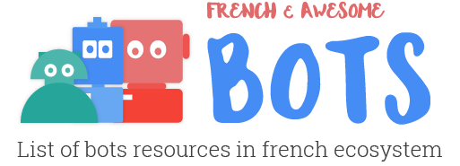

  

 
 

Table of Contents
-----------------

- [Bot's building tools](#bot-s-building-tools)
- [Chatbot agency](#chatbot-agency)
- [French bots](#french-bots)
- [Upcomming events](#upcoming-events)
- [Meetups](#meetups)
- [Slack groups](#slack-groups)

## Bot's building tools
* [Recast.AI](https://recast.ai?ref=github-bots) - Collaborative Bot Platform for developers: build conversational bots easily.

## Chatbot agency
* [The chatbot Factory](http://www.thechatbotfactory.com/) - Startup spécialiste des chatbots intelligents et évolutifs.
* [Botfuel](http://botfuel.io/) - Plateforme de développement de bots pour les entreprises.
* [Argoz](http://www.argoz.io/) - Nous développons des ChatBots intelligents sur Messenger, Slack et Telegram.

## French bots
* [Citron](http://m.me/meetcitron) - Les meilleurs lieux de Paris en 30s.
* [Voyages-sncf](https://www.facebook.com/VbotMessenger/) - Un bot spécialiste du voyage en train.
* [Sleek](https://www.messenger.com/t/184343611989882) - Votre assistant dédié à la culture.

## Upcoming events
* [Meetup](https://www.meetup.com/Chatbots-Paris/events/231620389/) - *03/11/2016*, _Paris_ - Les chatbots attaquent le E-commerce
* [Startup weekend](http://www.up.co/communities/france/paris/startup-weekend/9223) - *04/11/2016*, _Paris_ - The first Startup Weekend dedicated to artificial intelligence
* [Hackathon](http://hackathonprioriteclient.airfrance.fr/?utm_source=bma&utm_medium=events&utm_content=&utm_campaign=afprioriteclient) - *25/11/2016*, _Paris_ - Airfrance, 48h pour améliorer l'expérience de voyage en cas d'irrégularité!
* [Conference](http://www.dotai.io/) - *25/04/2017*, _Paris_ - The Artificial Intelligence & Machine Learning Conference for Developers

## Meetups
* [Paris Bots Meetup](http://www.meetup.com/fr-FR/Paris-Bots-Meetup/) - Bots: demos, live codes, retour d'expérience, réflexions et discussions autour du sujet.
* [Chatbots Paris Meetup](http://www.meetup.com/fr-FR/Chatbots-Paris/) - Découvrir les technologies, les tendances, les startups, les meilleurs usages de l'univers des bots.

## Slack groups
* [Paris Bots](https://parisbots.herokuapp.com/)
* [Recast.AI community](https://slack.recast.ai/)

## License

To the extent possible under law, [Jasmine Anteunis](http://jasmine.anteunis.name) has waived all copyright and related or neighboring rights to this work.
